# Awesome-Cloud-Migration-Discovery

# Awesome-Cloud-Migration-Discovery 🔍 ☁️



  





  
  
  
  
  
  



---

## 🌟 Top Cloud Migration Discovery Ecosystem

**Curated List of Commercial Discovery Platforms & Open-Source Assessment Tools**  
*Focused on Agentless Discovery, Dependency Mapping, Application Topology, 7R Strategy Assessment & Self-Hosted Migration Planning*

**Last updated: October 2026** 📅

---

### 📌 Overview & SEO Summary
Welcome to the ultimate curated directory of **cloud migration discovery platforms**, **open-source infrastructure assessment tools**, and **application dependency mapping frameworks**. Whether you are looking for enterprise-grade commercial solutions (such as *AWS Application Discovery Service*, *Azure Migrate*, and *Cloudamize*), or self-hostable open-source alternatives (like *Prophet*, *AIFORCE Discovery Agent*, and *Discovr*), this list covers category leaders, network scanning engines, and privacy-respecting migration assessment.

**Key Market Context:**
- **AWS Application Discovery Service** and **Migration Evaluator** are **free AWS services** for discovery and assessment .
- **Azure Migrate** is **free** for discovery, assessment, and migration planning .
- **Cloudamize** has delivered **1000+ assessments** with **70-80% average reduction in planning time** and **48% average cost savings** .

---

## 📑 Table of Contents
- [🏢 SaaS & Commercial Platforms](#-saas--commercial-platforms)
- [🔓 Open-Source GitHub Projects](#-open-source-github-projects)
- [🛠️ How to Contribute](#%EF%B8%8F-how-to-contribute)
- [📊 Star History](#-star-history)
- [🤝 Support & Sponsorship](#-support--sponsorship)
- [⚠️ Disclaimer](#%EF%B8%8F-disclaimer)

---

## 🏢 SaaS / Commercial Platforms

The cloud migration discovery market spans **hyperscaler native tools** (AWS, Azure, Google) that provide **free discovery and assessment**, and **specialized third-party platforms** (Device42, Flexera, Cloudamize) that offer **deeper dependency mapping, application topology visualization, and AI-augmented migration planning**. **Cloudamize** (now part of Accenture) provides **AI-Augmented Move Groups & Waves** that automatically organizes servers into intelligent migration groups using dependency analysis and connectivity patterns . **Device42** integrates with Azure Migrate as a workload migration assistance provider, producing Azure sizing and cost estimates . **Tidal Accelerator** is listed in AWS Prescriptive Guidance as a certified migration planning tool .

| SaaS / Commercial Platform | Company / Owner | Valuation / Market Cap | Standard Edition Starting Price | Free Tier / Free Trial Limits | Description |
| :--- | :--- | :--- | :--- | :--- | :--- |
| **[AWS Application Discovery Service](https://aws.amazon.com/application-discovery/)** ☁️ | Amazon | ~$2.0 Trillion | **Free service**; pay only for underlying S3, Athena | **Free forever** (discovery itself) | **AWS-native discovery** — **Agentless Collector (OVA)** for VMware vCenter gathers configuration and utilization data without agents . **Agent-based discovery** installs on physical/VM/EC2 for detailed process and network connection data. |
| **[Azure Migrate](https://azure.microsoft.com/en-us/products/azure-migrate/)** 🔷 | Microsoft | ~$3.90 Trillion | **Free service**; partner tools may charge | **Free forever** (discovery, assessment, planning)  | **Azure-native migration hub** — **Unified platform** for servers, databases, web apps, and virtual desktops . **Azure Migrate collector** for air-gapped/restricted networks. |
| **[Google Cloud Migration Center](https://cloud.google.com/migration-center)** 🌐 | Google (Alphabet) | ~$2.0 Trillion | **Free assessment**; pay for underlying GCP resources | **$300 free credits** for new customers | **GCP-native migration planning** — **StratoZone** agentless discovery. **1:1 cost comparison** via RVTools and ServiceNow imports. |
| **[Cloudamize](https://www.cloudamize.com/)** 📊 | Accenture | ~$200 Billion (Accenture) | **Custom enterprise pricing** | **Demo available** | **AI-augmented migration planning** — **1000+ assessments**, **70-80% reduction in planning time**, **48% average cost savings** . **AI-Augmented Move Groups & Waves** automatically organizes servers using dependency and connectivity analysis . **Graviton savings analysis** identifies ARM64 migration opportunities . |
| **[Device42](https://www.device42.com/)** 🔍 | Device42 | Private | **Custom enterprise pricing** | **Trial available** | **Discovery and dependency mapping** — **Agentless discovery** of on-premises infrastructure and applications . **Cloud Recommendation Engine** produces Azure sizing and cost estimates. **Integrates with Azure Migrate** as a workload migration assistance provider . |
| **[Flexera One](https://www.flexera.com/)** 💰 | Flexera | Private (est. ~$500M revenue) | **Custom enterprise pricing**; no free version | **No free trial** | **Multi-cloud migration planning** — **Workload placement** with full visibility into current workloads . **Cloud cost comparison** across providers to inform migration decisions. |
| **[Turbonomic](https://www.ibm.com/products/turbonomic)** ⚙️ | IBM | ~$200 Billion | **Custom enterprise pricing** | **30-day free trial** | **Application resource management** — **Migration planning with Lift & Shift vs Optimized scenarios** . **Optimized migration** analyzes historical utilization to recommend right-sized cloud instances. |
| **[CAST Highlight](https://www.castsoftware.com/)** 🎯 | CAST Software | Private | **Custom enterprise pricing** | **Demo available** | **Application portfolio assessment** — **Scans source code** for cloud maturity, blockers, and open source risks . **5R disposition recommendations** with migration waves. |
| **[StratoZone](https://cloud.google.com/migration-center)** 🌐 | Google (Alphabet) | ~$2.0 Trillion | **Free with Google Cloud Migration Center** | **Free forever** | **Agentless discovery** — **StratoProbe data collector** installs in **<45 minutes** and collects data over hours from thousands of assets. **Used by Google Cloud Migration Center** for assessment. |
| **[Tidal Accelerator](https://www.tidalcloud.com/)** 🌊 | Tidal | Private | **Custom pricing** | **Demo available** | **Migration management platform** — **Listed in AWS Prescriptive Guidance** as a certified migration planning tool . Enterprise migration orchestration and tracking. |

---

## 🔓 Open-Source GitHub Projects

*Sorted by GitHub_Stars_Count (Descending)* 🌟

- **[Prophet (Cloud-Discovery)](https://github.com/Cloud-Discovery/prophet)**   
  **Automated resource collection, analysis, and management toolset for cloud migration and disaster recovery**, open-source. **27 stars, 12 forks** . **Modern Web interface and powerful CLI** for comprehensive collection and analysis of **physical machines and VMware environments** . **Core value**: automated collection via multiple protocols (**nmap, Ansible, WMI, VMware API**), visualized analysis with application topology canvas, automatic data masking to remove sensitive information, and **containerized deployment** with Docker Compose . **Web UI features**: host management, application management with visual canvas for business topology and host dependencies, scanning tasks, VMware platform management, tag management, and data import/export . **CLI functions**: network scanning via nmap, detailed collection via VMware API/Ansible/Windows WMI, data analysis and report generation, and data packaging with automatic masking . **The most complete open-source migration discovery toolset**. 🔍

- **[AIFORCE Discovery Agent (CryptoYogiLLC)](https://github.com/CryptoYogiLLC/aiforce-discovery-agent)**   
  **Open-source microservices-based discovery agent for cloud modernization**, open-source. **Runs in client environments to discover applications, dependencies, and technical debt** . **Six specialized collector profiles**: **Network Scanner** (discover servers, ports, services), **Code Analyzer** (analyze git repositories), **Database Inspector** (extract schemas, detect PII), **Infra Probe** (SSH-based system info), **Processor** (enrichment, PII redaction, scoring), and **Gateway** (UI and API) . **Docker Compose profiles** for selective deployment — start only what you need . **PostgreSQL, Redis, RabbitMQ** for data persistence and messaging. **Admin UI at localhost:3000** with approval workflows . **The most modular open-source discovery agent** — designed for modernization assessment. 🤖

- **[Discovr (Naman1997)](https://github.com/Naman1997/discovr)**   
  **Portable asset discovery CLI for on-premise and cloud environments**, open-source . **Active, passive, and Nmap network discovery** plus **cloud inventory for AWS, Azure, and GCP** . **Interactive TUI** for guided scans. **Active scanning**: ARP or ICMP probes across CIDR ranges with configurable concurrency, timeout, and export to CSV . **Passive scanning**: listens to traffic on an interface to identify devices without active probes . **Nmap wrapper**: runs Nmap scans with OS detection and custom port ranges . **Cross-platform**: Linux, macOS, Windows. **Go-based, single binary**. **The most accessible open-source discovery CLI**. 🎯

- **[Auto Host Info Collector (OnePro Cloud)](https://docs.oneprocloud.com/product-overview/presales/auto-host-info-collector.html)**   
  **Automated host information collection tool for cloud migration assessment**, open-source . **Prophet CLI wrapper** with scan, collect, and report operations. **Scan function**: discovers live hosts in IP ranges (e.g., `192.168.10.2-50`) and generates CSV with hostname, IP, MAC, vendor, OS type/version, and open TCP ports . **Collect function**: detailed information collection via VMware API (ESXi/vCenter), Ansible (Linux), and WMI (Windows) . **Automatic masking** removes sensitive authentication information from collected packages . **Docker container** available: `docker pull registry.cn-beijing.aliyuncs.com/oneprocloud-opensource/cloud-discovery-prophet:latest` . **The most straightforward open-source host collector** for migration pre-assessment. 📋

- **[xmigrate](https://github.com/xmigrate/xmigrate)**   
  **Cloud migration tool for migrating on-premise data and infrastructure to cloud**, open-source . **Python-based** (27.2 MB codebase). **Focuses on data and infrastructure migration** rather than just discovery. **The most comprehensive open-source migration execution tool**. 🚀

- **[CloudShift (oslabs-beta)](https://github.com/oslabs-beta/CloudShift)**   
  **Tool for securely migrating object storage data between cloud providers**, open-source. **67 stars, 2 forks** . **JavaScript-based** (33.9 MB). **Focuses on S3-compatible object storage migration** — complementing infrastructure discovery. **The most focused open-source object storage migration tool**. 📦

- **[machine_stats (tidalmigrations)](https://github.com/tidalmigrations/machine_stats)**   
  **Simple and effective way to gather machine statistics (RAM, Storage, CPU) from Windows or Unix server environments**, open-source . **Ruby-based** (16.4 MB). **Lightweight data collection** for migration assessment. **Complements Tidal Accelerator** for migration planning. 📊

- **[goto_cloud](https://github.com/jdepoix/goto_cloud)**   
  **Automate migrating your Server Infrastructure from on-prem or cloud to another cloud**, open-source . **Python-based** (252 KB). **Lightweight migration automation** for server infrastructure. 🔧

- **[Azure-Migrate (wimmatthyssen)](https://github.com/wimmatthyssen/Azure-Migrate)**   
  **Azure PowerShell scripts used during Azure Migrate projects**, open-source . **28.3 KB**. **Practical scripts** for Azure migration assessment and execution. ☁️

---

## 🛠️ How to Contribute

Contributions are welcome! Follow these steps to submit new migration discovery platforms or open-source assessment software:

1. 🍴 **Fork** the repository.
2. 📝 **Add/edit** entries in `README.md` maintaining table/list structure and formatting.
3. 🔗 Include project title, official website/GitHub link, exact Stars_Count, license, and brief description.
4. 🚀 Submit a **Pull Request** with a descriptive summary of your changes.

---

## 📊 Star History



---

## 🤝 Support & Sponsorship

If you find this cloud migration discovery repository useful, please consider supporting the project:

- ⭐ **Star** this repository to increase visibility!
- 🔀 **Fork** and share with fellow migration architects, platform engineers, and open-source advocates.
- ☕ **Sponsor & Buy Me a Coffee**: Support ongoing open-source curation via the [GitHub Sponsor Dashboard](https://github.com/sponsors/ishandutta2007).

---

## ⚠️ Disclaimer

- This is a **community-curated** list — not exhaustive and not an endorsement. ℹ️
- **AWS Application Discovery Service and Migration Evaluator are free** for discovery and assessment — you only pay for underlying S3 storage and Athena queries used to analyze exported data . **Azure Migrate is free** for discovery, assessment, and planning .
- **Cloudamize has delivered 1000+ assessments** with **70-80% average reduction in planning time** and **48% average cost savings** . **Accenture reduced its typical application migration cycle from 3 months to 3 weeks** after adopting Cloudamize .
- **Open-source tools (Prophet, AIFORCE Discovery Agent, Discovr) are not turnkey** — **Prophet requires Docker Compose deployment** . **AIFORCE requires 4GB RAM minimum** and network access to target systems . **Discovr requires Go build or pre-compiled binary** . **Always validate discovery results with a proof-of-concept** before committing to production migration timelines. 🔍

---



  <b>Made with ❤️ for migration architects, platform engineers, and open-source discovery advocates.</b>

